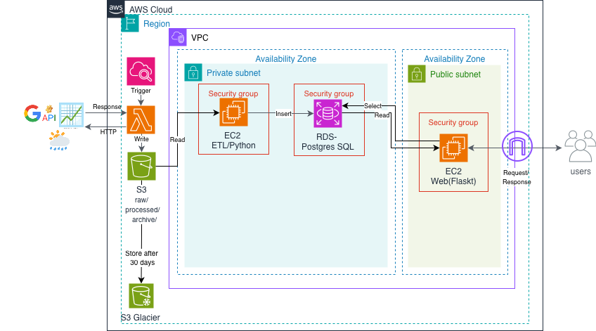
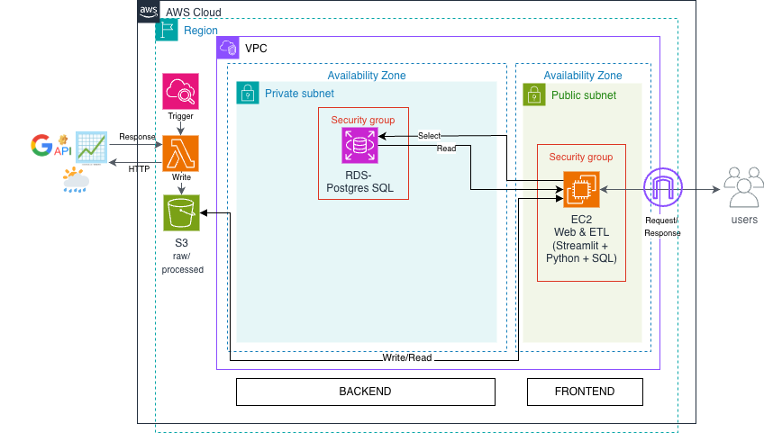

# Cloud-Based Data Pipeline & Analytics Platform (AWS)

An end-to-end cloud data pipeline built on AWS to ingest external APIs,
process and store structured data, and surface analytics through a
lightweight user-facing application.

---

## Architecture

### Initial Design (Planned)


### Implemented Architecture


#### Architecture Note
- The implemented architecture reflects practical AWS constraints and
intentional design choices.
- RDS, which stores structured application data, was placed in a
private subnet to limit direct network exposure.
- EC2 instances were deployed in a public subnet to simplify access and
deployment across lab environments and regions, with access controlled
through security groups.
- S3 was not placed within a subnet, as it is a managed AWS service.
Access to S3 was restricted using IAM roles rather than network isolation.
- S3 lifecycle features such as Glacier were intentionally excluded, as
long-term archival was not required for the scope of this project.

---
## Demo

A short end-to-end demo video of the working system:
👉 [Watch Demo Video](docs/demo/demo_video.md)

---

## Project Overview

This project demonstrates the design and implementation of a cloud-based
data pipeline that integrates multiple external data sources, performs
ETL processing, and delivers analytics-ready datasets through a
Streamlit dashboard.

The focus of this project is on data pipeline design, cloud infrastructure,
and reproducible data processing workflows.

---

## What I Built (End-to-End)

- Designed the AWS pipeline architecture  
  (S3 → Lambda / EC2 ETL → RDS → EC2 Streamlit)
- Implemented Python-based ETL pipelines to clean, merge, and transform
  multi-source datasets
- Designed and implemented a PostgreSQL schema optimized for analytics queries
- Built a Streamlit dashboard with caching and interactive analytics views
- Documented architecture decisions and data flow for clarity and reproducibility

---

## Project Structure


```
📁 Project Structure

📁 Project Structure

├── architecture/          # Architecture diagrams and design rationale
├── Lambda/                # AWS Lambda functions (ingestion / orchestration)
├── src/
│   ├── streamlit_app/     # Streamlit dashboard
│   ├── etl/               # ETL pipelines
│   └── analysis/          # Analysis scripts
├── sql/                   # PostgreSQL schema
├── docs/                  # Detailed documentation
│   └── demo/
│       └── demo_video.md  # Demo video link
├── README.md
└── requirements.txt


```


---

## Key Technologies

- **Cloud**: AWS S3, EC2, RDS (PostgreSQL), Lambda, IAM, VPC
- **Data Engineering**: Python, ETL pipelines, REST API ingestion
- **Databases**: PostgreSQL
- **Visualization**: Streamlit
- **Analytics Libraries**: Pandas, NumPy

---

## How to Run (Local)

```bash
pip install -r requirements.txt
streamlit run src/streamlit_app/app_cloud.py


